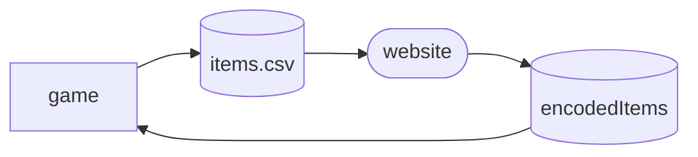
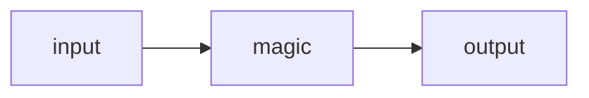

<div id="top"></div>

<!-- PROJECT LOGO -->
<br />
<div align="center">
  <a href="https://github.com/jellemeeus/auction">
  </a>

  <h3 align="center">
  Auction</h3>
</div>

<!-- TABLE OF CONTENTS -->
<details>
  <summary>Table of Contents</summary>
  <ol>
    <li>
      <a href="#about-the-project">About The Project</a>
      <ul>
        <li><a href="#requirements">Requirements</a></li>
        <li><a href="#built-with">Built With</a></li>
        <li><a href="#resources">Resources</a></li>
      </ul>
    </li>
    <li><a href="#usage">Usage</a></li>
    <li><a href="#notes">Notes</a></li>
    <li><a href="#gui">GUI</a></li>
    <li><a href="#upload">Upload</a></li>
    <li><a href="#license">License</a></li>
  </ol>
</details>

# Auction

## Built With

TODO

gorm ORM
gin web framework

REST vs GraphQL
use REST.small project, simple data, API users use the same data, only 1 source

playwright simple gui test
postman

swagger

zap logger
https://github.com/uber-go/zap

https://apitest.dev/
apitest


## Requirements
go1.22.0 linux/amd64

## Resources
to be added
https://www.knowledgefactory.net/2022/01/go-lang-vuejs-mysql-crud-example.html
https://github.com/vacaramin/Go-Websocket-ChatRoom

https://www.youtube.com/watch?v=8uiZC0l4Ajw

chat client massive
https://github-com.translate.goog/GoBelieveIO/im_service/tree/master?_x_tr_sl=auto&_x_tr_tl=en&_x_tr_hl=en

## Usage

`/hlm p`

https://github.com/jellemeeus/Hloot

## Roadmap
Addon export [x]
- [x] Export game data
- [x] Import game data

Website [ ]

philosophy: build like a CRUD app and then expand, add tests, basic CI

- [ ] join room as viewer or lootmaster
- [ ] authenticate viewer
- [ ] authenticate lootmaster
- [ ] join room with a code
- [ ] show users that are listening
- [x] add dark theme
- [x] status bar with some content
- [x] navigate to index, a room
- [x] form design
- [x] form slider for fee %, bid duration, countdown
- [x] form page
- [x] go to a new room
- [ ] design room mongoDB document structure
- [ ] Validate form input
- [x] form page and navigate to a room
- [ ] display auction
- [ ] display a list of auctions
- [ ] add buttons
- [ ] make scrollable list for many auctions
- [ ] Keep footer or a header on top for data / filtering
- [ ]
- [ ]
- [ ]


create room with form data.:
  lootmaster: 'Lootmaster',
  enableDiscordProtection: false,
  bidDurationInSeconds: 240,
  countDownTimeInSeconds: 40,
  restrictBidsToEquipable: false,
  hideNameOfHighestBidder: false,
  hidePayoutDetails: false,
  organiserFee: 10,
  minimumBid: 10,
  minimumBidIncrement: 1,
  
// JSON Room
{
  "name": "Lootmaster",
  "enableDiscordProtection": false,
  "organiserFee": 10,
  "minimumBid": 10,
  "minimumBidIncrement": 1,
  "bidDurationInSeconds": 240,
  "countDownTimeInSeconds": 40,
  "restrictBidsToEquipable": false,
  "hideNameOfHighestBidder": false,
  "hidePayoutDetails": false,
  "users": [
    { "name": "user1" },
    { "name": "user2" },
    { "name": "user3" },
    { "name": "user4" },
  ],
  "auctions": [
  {
  "rowId": 1,
  "status": 1,
  "expiration": 1708217000,
  "itemId": 19137,
  "guid": "noguid"
  "minimumPrice": 3000,
  "itemName": "Onslaught Girdle",
  "quality": 4,
  "itemLevel": 78,
  "minLevel": 60,
  "itemType": "Armor",
  "itemSubType": "Plate",
  },
  {
  "rowId": 2,
  "status": 1,
  "expiration": 1708217000,
  "itemId": 18814,
  "guid": "noguid"
  "minimumPrice": 3000,
  "itemName": "Choker of the Fire Lord",
  "quality": 4,
  "itemLevel": 78,
  "minLevel": 60,
  "itemType": "Armor",
  "itemSubType": "Miscellaneous",
  },
  {
  "rowId": 3,
  "status": 1, "expiration": 1708217000,
  "itemId": 12282,
  "guid": "Item-5827-0-40000000C90648E0"
  "minimumPrice": 1000,
  "itemName": "Worn Battleaxe",
  "quality": 1,
  "itemLevel": 2,
  "minLevel": 1,
  "itemType": "Weapon",
  "itemSubType": "Weapon,Two-Handed Axes",
  },
  {
  "rowId": 4,
  "status": 1,
  "expiration": 1708217000,
  "itemId": 12282,
  "guid": "Item-5827-0-40000000C90648DE"
  "minimumPrice": 1000,
  "itemName": "Brawler's Boots",
  "quality": 1,
  "itemLevel": 1,
  "minLevel": 1,
  "itemType": "Armor",
  "itemSubType": "Miscellaneous",
  },
  ]
}

        input (string) or given a string is best
        settings: x important, o not important
            x minBid: integer
            o allowOS: toggle
            o class restriction (experimental): toggle
            o highest bidder visible: toggle
            o show total pot + payout details: toggle
            x bidDuration: integer
            x countdown: integer
            x organiser fee (%): float 15.0
        flair: realm, faction
        discord protection: toggle

Options for toggles
group: ref(['op1'])
options: [ { label: 'Option 1', value: 'op1' }, { label: 'Option 2', value: 'op2' }, { label: 'Option 3', value: 'op3' } ]
  <div class="q-pa-lg">
    <q-option-group
      v-model="group"
      :options="options"
      color="yellow"
      type="toggle"
    />
  </div>

## Notes

data / schema

https://dbdiagram.io/d/auction-65c9ab1aac844320aeec5e81


1. meta data


1. Loot master interaction
addon handles exporting of items
website handles auctions + cuts
addon handles trading player items

```mermaid
flowchart LR;
    in-->website-->out-->trade
    out[(sold_items.csv)]
    in([addon export items])
    out([addon import auctions])
    trade([trade items])
    website([auctions website])
  ```

1. Player interaction
no addon required for player

```mermaid
flowchart LR;
    website-->game
    game([trade loot master for item])
    website([bid with website gui])
  ```

1. Addon export items
```mermaid
flowchart LR;
    export-->data
    data[(items.csv)]
    export(["Session:ExportAllPendingAuctionsToGUI()"])
```


`/hlm e` export

Add items with hlma (from id) or with shift+click (from bags)

note: items created with /hlma do not have a guid and when importing are not auto-tradeable
shift+click items to add. will export/import the guid and allow auto-trading

Test string for /hlma
```/hlma 19137 18814 17076 18563 17069 17071 17105 17204 16795 16808 16813 16821 16834 16842 16846 16854 16866 18264 18260 17011```
smaller
```/hlma 19137 18814 17076```


`/hlm e`
```
rowId,id,name,quality,ilvl,minLevel,itemType,itemSubType,infoStatus,infoMinPrice,guid
1,19137,Onslaught Girdle,4,78,60,Armor,Plate,1,3000,noguid
2,18814,Choker of the Fire Lord,4,78,60,Armor,Miscellaneous,1,3000,noguid
3,17076,Bonereaver's Edge,4,77,60,Weapon,Two-Handed Swords,1,3000,noguid
4,12282,Worn Battleaxe,1,2,1,Weapon,Two-Handed Axes,1,3000,Item-5827-0-40000000C90648E0
5,140,Brawler's Boots,1,1,0,Armor,Miscellaneous,1,3000,Item-5827-0-40000000C90648DE
```


`/hlm i`

itemIdreateForId(tonumber(elements[1]))
  item.info = {
    status = tonumber(elements[2]),
    minPrice = tonumber(elements[3]),
    exp = tonumber(elements[4]),
    winner = elements[5],
    salePrice = tonumber(elements[6])
  }
  item.guid = elements[7] -- Encode != Decode. Field is only needed to be decoded from GUI
```
rowID,itemId,status,minPrice,exp,winner,salePrice,guid
1:12282,3,3000,1707706195,Anonuwu,3000:2:19137,3,3000,1707706195,Anonuwu,3100,Item-5827-0-40000000C90648DE
```


1. Website
TODO: itemName, icon, rarity from wowhead API


## Frontend

output
```
rowID,itemId,status,minPrice,exp,winner,salePrice,guid
1:12282,3,3000,1707706195,Anonuwu,3000:2:19137,3,3000,1707706195,Anonuwu,3100,Item-5827-0-40000000C90648DE
```

/index page
  form
  join room
  create room
/raid/unique
  session
  participate form
  admin start/stop
  list of items
  buttons to control
  interact with db


# Tools installed
Typescript
JSX
Vue Router
Pinia
Vitest
E2E Playright
ESLINT+Prettier

```
npm create vite@latestnpm install primevue✔ Project name: … auction
✔ Add TypeScript? … No / Yes
✔ Add JSX Support? … No / Yes
✔ Add Vue Router for Single Page Application development? … No / Yes
✔ Add Pinia for state management? … No / Yes
✔ Add Vitest for Unit Testing? … No / Yes
✔ Add an End-to-End Testing Solution? › Playwright
✔ Add ESLint for code quality? … No / Yes
✔ Add Prettier for code formatting? … No / Yes
```


## Backend


## Config

## Database

TODO: update addon to export fields
TODO: update addon to import fields? probably not needed
_id
rowId
itemId
status
minPrice
expiration
itemName
quality
ilvl
minLevel
itemType
itemSubType
guid

https://learn.microsoft.com/en-us/aspnet/core/tutorials/first-mongo-app?view=aspnetcore-8.0&tabs=visual-studio-code

mongodb
compass

mongodb://localhost:27017

response of GET request to /api/auctions
```
[
  {
    "id": "65d1eeb92ba931f1cf61f531",
    "rowId": 1,
    "itemId": 19137,
    "status": 1,
    "minimumPrice": 3000,
    "expiration": 1708217000,
    "itemName": "Onslaught Girdle",
    "quality": 4,
    "itemLevel": 78,
    "minLevel": 60,
    "itemType": "Armor",
    "itemSubType": "Plate",
    "guid": "noguid"
  },
  ...
]
```

## Implementing GUI

[Python.org]: https://img.shields.io/badge/Python-14354C?style=for-the-badge&logo=python&logoColor=white
[Python-url]: https://www.python.org/
[React.js]: https://img.shields.io/badge/React-20232A?style=for-the-badge&logo=react&logoColor=61DAFB
[React-url]: https://reactjs.org/
[Bootstrap.com]: https://img.shields.io/badge/Bootstrap-563D7C?style=for-the-badge&logo=bootstrap&logoColor=white
[Bootstrap-url]: https://getbootstrap.com
[Electron.js]: https://img.shields.io/badge/Electron-191970?style=for-the-badge&logo=Electron&logoColor=white
[Electron-url]: https://www.electronjs.org/


[Twitch.com]: 	https://img.shields.io/badge/Twitch-9146FF?style=for-the-badge&logo=twitch&logoColor=white
[Twitch-url]:    https://twitch.com
[Youtube-url]:    https://youtube.com
[Youtube.com]: https://img.shields.io/badge/YouTube-FF0000?style=for-the-badge&logo=youtube&logoColor=white
[gui-screenshot]: https://github.com/jellemeeus/gui-compilation-from-cluster/raw/main/screenshot.png
