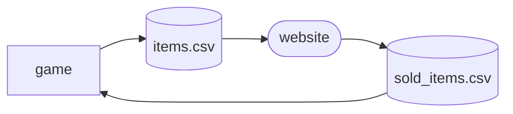
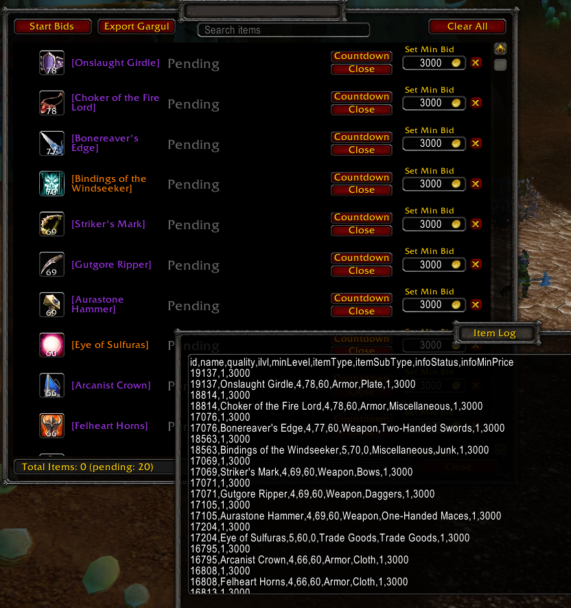
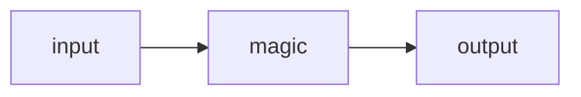

<div id="top"></div>

<!-- PROJECT LOGO -->
<br />
<div align="center">
  <a href="https://github.com/Ella36/auction">
  </a>

  <h3 align="center">
  Auction</h3>
</div>

<!-- TABLE OF CONTENTS -->
<details>
  <summary>Table of Contents</summary>
  <ol>
    <li>
      <a href="#about-the-project">About The Project</a>
      <ul>
        <li><a href="#requirements">Requirements</a></li>
        <li><a href="#built-with">Built With</a></li>
        <li><a href="#resources">Resources</a></li>
      </ul>
    </li>
    <li><a href="#usage">Usage</a></li>
    <li><a href="#notes">Notes</a></li>
    <li><a href="#gui">GUI</a></li>
    <li><a href="#upload">Upload</a></li>
    <li><a href="#license">License</a></li>
  </ol>
</details>

# Auction

## Built With

TODO

gorm ORM
gin web framework

REST vs GraphQL
use REST.small project, simple data, API users use the same data, only 1 source

playwright simple gui test
post

zap logger
https://github.com/uber-go/zap

https://apitest.dev/
apitest


## Requirements
go1.22.0 linux/amd64

## Resources
to be added
https://www.knowledgefactory.net/2022/01/go-lang-vuejs-mysql-crud-example.html
https://github.com/vacaramin/Go-Websocket-ChatRoom

https://www.youtube.com/watch?v=8uiZC0l4Ajw

chat client massive
https://github-com.translate.goog/GoBelieveIO/im_service/tree/master?_x_tr_sl=auto&_x_tr_tl=en&_x_tr_hl=en

## Usage

`/hlm p`

https://github.com/Ella36/Hloot

## Roadmap
Addon export [x]
- [x] Export game data

Website [ ]

philosophy: build like a CRUD app and then expand, add tests, basic CI

- [ ] import JSON data
- [ ] parse and reply with auctions to render
- [ ] show data to listeners
- [ ] print list of auctions
- [ ] make a room
- [ ] join room as viewer or lootmaster
- [ ] authenticate viewer
- [ ] authenticate lootmaster
- [ ] join room with a code
- [ ] show users that are listening

Addon import
- [ ] take JSON and import
- [ ] add auctions as "sold" so they can be traded by addon

## Notes

1. meta data


1. Loot master interaction
addon handles exporting of items
website handles auctions + cuts
addon handles trading player items

```mermaid
flowchart LR;
    in-->website-->out-->trade
    out[(sold_items.csv)]
    in([addon export items])
    out([addon import auctions])
    trade([trade items])
    website([auctions website])
  ```

1. Player interaction
no addon required for player

```mermaid
flowchart LR;
    website-->game
    game([trade loot master for item])
    website([bid with website gui])
  ```

1. Addon export items
```mermaid
flowchart LR;
    export-->data
    data[(items.csv)]
    export(["Session:ExportAllPendingAuctionsToGUI()"])
```



Info required: itemID, itemName?, minimumPrice
TODO: since items are fixed aka always the same same
TODO: format the session log better. Low prio
TODO: format the addon different branch to disable or remote functionality not needed
```csv
date,itemID,itemName,player,salePrice
10-02-2024,117,Tough Jerky,,0
10-02-2024,6125,Brawler's harness,,0
...
```

1. Website
TODO: itemName, icon, rarity from wowhead API


## Config

## Database

## Implementing GUI

[Python.org]: https://img.shields.io/badge/Python-14354C?style=for-the-badge&logo=python&logoColor=white
[Python-url]: https://www.python.org/
[React.js]: https://img.shields.io/badge/React-20232A?style=for-the-badge&logo=react&logoColor=61DAFB
[React-url]: https://reactjs.org/
[Bootstrap.com]: https://img.shields.io/badge/Bootstrap-563D7C?style=for-the-badge&logo=bootstrap&logoColor=white
[Bootstrap-url]: https://getbootstrap.com
[Electron.js]: https://img.shields.io/badge/Electron-191970?style=for-the-badge&logo=Electron&logoColor=white
[Electron-url]: https://www.electronjs.org/


[Twitch.com]: 	https://img.shields.io/badge/Twitch-9146FF?style=for-the-badge&logo=twitch&logoColor=white
[Twitch-url]:    https://twitch.com
[Youtube-url]:    https://youtube.com
[Youtube.com]: https://img.shields.io/badge/YouTube-FF0000?style=for-the-badge&logo=youtube&logoColor=white
[gui-screenshot]: https://github.com/Ella36/gui-compilation-from-cluster/raw/main/screenshot.png